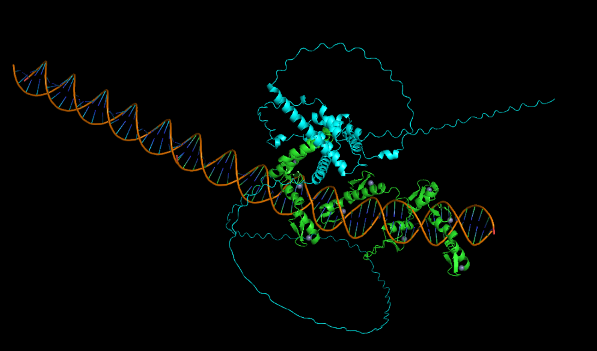
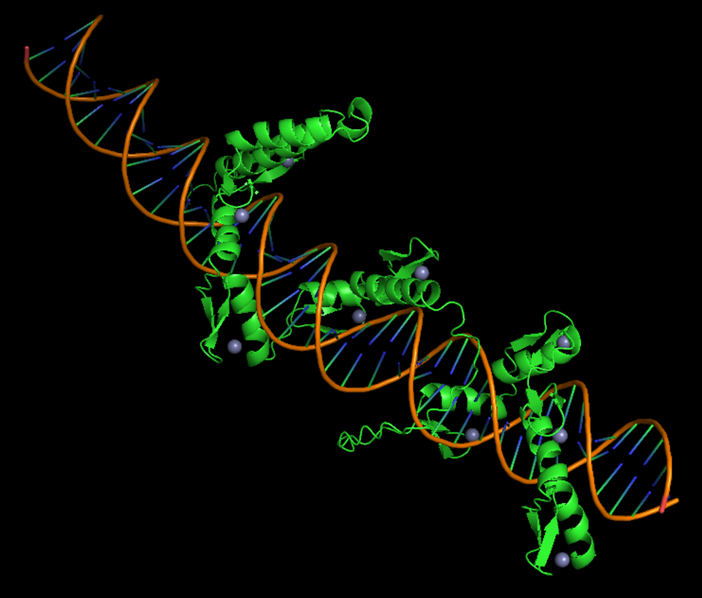

# 🔬 PDB/MMCIF toolkit in Molecular Dynamic Simulation workflows

> [!WARNING]
> Formerly published on PyPI as `pdb-select`. That name is deprecated — use `pdb-md`.

> Pre- and post-processing toolkit for PDB/MMCIF structure files in molecular dynamics workflows.  

# Installation

```bash
pip install pdb-md
```

# Usage

```bash
pdb-md --help
                                                                        
 Usage: pdb-md [OPTIONS] COMMAND [ARGS]...                                                                                                                                          
                                                                                                                                                                                        
 Segment selector for PDB/MMCIF Structure file                                                                                                                                          
                                                                                                                                                                                        
╭─ Options ────────────────────────────────────────────────────────────────────────────────────────────────────────────────────────────────────────────────────────────────────────────╮
│ --install-completion          Install completion for the current shell.                                                                                                              │
│ --show-completion             Show completion for the current shell, to copy it or customize the installation.                                                                       │
│ --help                        Show this message and exit.                                                                                                                            │
╰──────────────────────────────────────────────────────────────────────────────────────────────────────────────────────────────────────────────────────────────────────────────────────╯
╭─ Commands ───────────────────────────────────────────────────────────────────────────────────────────────────────────────────────────────────────────────────────────────────────────╮
│ select  Select segments from a PDB or MMCIF structure file.                                                                                                                          │
╰──────────────────────────────────────────────────────────────────────────────────────────────────────────────────────────────────────────────────────────────────────────────────────╯                                                                        
```

## 1️⃣ select

> [!WARNING] 
> The `segment` range parameter we using is filtered based on `resseq of (hetflag, resseq, icode) tuple output by residue.get_id() in Bio.PDB module of biopython`.
> 
> Resseq from few structures match UniProt. We only perform this test on AlphaFold output files.
> 
> So, we strongly recommend you to check th `SIFTS` mapping file for the structure you are going to use, and make sure the `segment` parameter is correct in Uniprot sequence-level meaning (most case).

`Select segments from a PDB or MMCIF structure file`

```bash
pdb-md select  --help
                                                                                                                                                                                        
 Usage: pdb-md select [OPTIONS]                                                                                                                                                     
                                                                                                                                                                                        
 Select segments from a PDB or MMCIF structure file.                                                                                                                                    
                                                                                                                                                                                        
╭─ Options ────────────────────────────────────────────────────────────────────────────────────────────────────────────────────────────────────────────────────────────────────────────╮
│ *  --input    -I      <path>  Input PDB or MMCIF file [required]                                                                                                                     │
│    --output   -O      <path>  Output PDB file, defaults to <input stem>_selected.pdb in the current working directory                                                                │
│ *  --segment  -s      <str>   Segments to select, either 'chain' (whole chain, e.g. A) or 'chain:start-end' (e.g. A:1-10). Repeatable. [required]                                    │
│    --help                     Show this message and exit.                                                                                                                            │
╰──────────────────────────────────────────────────────────────────────────────────────────────────────────────────────────────────────────────────────────────────────────────────────╯
```

example:

```bash
pdb-md select -I znf263_all_hs7_30_0.54_0.37_model_0.cif -O znf263_all_hs7_30_0.54_0.37_model_0_selected.pdb -S A:369-683 -S B -S C -S D -S E -S F -S G -S H -S I -S J -S K:1-47 -S L:29-75 -H ZN
```

change from 
 to


---

### Selecting HETATM / heterogen residues 

> In short: polymer residue is governed by `range` + `chain` double filter, while HETATM is governed by `chain` only. The `--keep-hetero` option is the only way to keep HETATM residues.

HETATM residues (ions, ligands, waters, sugars) are selected at the **chain** level, not by residue range. The `chain:start-end` syntax filters polymer residues only.

Consequences:

- A chain made entirely of HETATM (e.g. a single Zn ion, a glycan chain) is governed by the chain whitelist alone — `-S B` keeps the whole Zn.
- On a **mixed** chain, `chain:start-end` does NOT narrow which HETATM are kept: `-S A:1-3 --keep-hetero UNX` still keeps `UNX` at resid 109, because the HETATM branch ignores `regions`.
- `--keep-hetero ''` (default) drops every HETATM; `all` keeps them all; a comma list (e.g. `ZN, HOH`) is an exact resname whitelist (case-insensitive).

To pick specific HETATM on a mixed chain, split the chain in preprocessing (e.g. give the heterogen its own chain id) — the current CLI has no per-HETATM range selector.

#### `--keep-hetero` syntax 

`-H` is repeatable. Each entry is `[chain:]spec`:  

| entry | meaning |
|---|---|
| `-H ZN` | global: every chain keeps HETATM named `ZN` | 
| `-H ZN,HOH` | global: every chain keeps `ZN` and `HOH` |  
| `-H all` | global: every chain keeps all HETATM |
| `-H none` / `-H ''` | global: every chain drops all HETATM (default) | 
| `-H A:all` | chain A keeps all of its HETATM | 
| `-H A:none` | chain A drops all of its HETATM |
| `-H E:ZN,HOH` | chain E keeps only `ZN` and `HOH` |

Two rules govern how entries combine:  
1. **Union within the same scope.** Several entries for the same scope add up:
`-H ZN -H HOH` ≡ `-H ZN,HOH`, and `-H E:ZN -H E:HOH` ≡ `-H E:ZN,HOH`.
Adding an entry never removes something already whitelisted.
2. **A chain entry overrides the global entry.** A chain that has its own
`[chain:]` entry uses *only* that set and ignores the global one. This is what
makes per-chain removal expressible: `-H ZN -H J:none` keeps `ZN` everywhere except chain J.

A `-H` chain id must also appear in `--segment`; otherwise the chain is dropped before `-H` is ever consulted, and a warning is printed.

## 2️⃣ preprocessing for MD simulation

Here we summariz e several important easy to use application for fixing problems in Protein Data Bank files in preparation for simulating them.

|Tool name|Description|Url| Note |
|--|--|--| --- |
|PDBFixer|PDBFixer is an easy to use application for fixing problems in Protein Data Bank files in preparation for simulating them|https://github.com/openmm/pdbfixer <br><br> https://htmlpreview.github.io/?https://github.com/openmm/pdbfixer/blob/master/Manual.html| General purpose tool for fixing PDB files|
|pdb2gmx|gmx pdb2gmx reads a .pdb (or .gro) file, reads some database files, adds hydrogens to the molecules and generates coordinates in GROMACS (GROMOS), or optionally .pdb, format and a topology in GROMACS format. These files can subsequently be processed to generate a run input file|https://manual.gromacs.org/current/onlinehelp/gmx-pdb2gmx.html| Designed for preparing PDB files for GROMACS simulations, pdb2gmx is a subcommand of GROMACS tool gmx —— `gmx pdb2gmx`, it has several options for pdb file processing like `-ignh` to add the hydrogens, see in `gmx pdb2gmx -h` |
|pdb4amber|Analyse PDB files and clean them for further usage, especially with the LEaP programs of Amber |https://ambermd.org/AmberTools.php | pdb4amber tool from the AmberTools MD package, designed for preparing PDB files for Amber simulations, also a command-line utility in the AmberTools suite —— `pdb4amber`, it also has several options for pdb file processing, Removing hydrogen or water atoms, see `pdb4amber -h`  |


### `normal preprocessing`

> cited from pdbfixer manual
```bash
- If the structure was generated by X-ray crystallography, most or all of the hydrogen atoms will usually be missing.
- There may also be missing heavy atoms in flexible regions that could not be clearly resolved from the electron density. This may include anything from a few atoms at the end of a sidechain to entire loops.
- Many PDB files are also missing terminal atoms that should be present at the ends of chains.
- The file may include nonstandard residues that were added for crystallography purposes, but are not present in the naturally occurring molecule you want to simulate.
- The file may include more than what you want to simulate. For example, there may be salts, ligands, or other molecules that were added for experimental purposes. Or the crystallographic unit cell may contain multiple copies of a protein, but you only want to simulate a single copy.
- There may be multiple locations listed for some atoms.
- If you want to simulate the structure in explicit solvent, you will need to add a water box surrounding it.
- For membrane proteins, you may also need to add a lipid membrane.
```

you can
```bash
Add missing heavy atoms.
Add missing hydrogen atoms.
Build missing loops.
Convert non-standard residues to their standard equivalents.
Select a single position for atoms with multiple alternate positions listed.
Delete unwanted chains from the model.
Delete unwanted heterogens.
Build a water box for explicit solvent simulations.

Remove Chains
Identify Missing Residues
Replace Nonstandard Residues
Remove Heterogens
Add Missing Heavy Atoms
Add Missing Hydrogens
Add Water
Add Membrane
```


### `protonation(add hydrogens)`

protonation state of the protein is important for MD simulation. The protonation state of a protein can be determined by the pH of the environment, which can affect the charge and conformation of the protein.

Here we summarize several tools for predicting or assigning the protonation state of a protein:

> Basically predicted/assigned based on comparison between Pka calculation and the pH of the environment. 

|Tool name|Description|Url| Note |
|--|--|--| --- |
|H++ |H++ is an automated system that computes pK values of ionizable groups in macromolecules and adds missing hydrogen atoms according to the specified pH of the environment. Given a (PDB) structure file on input, H++ outputs the completed structure in several common formats (PDB, PQR, AMBER inpcrd/prmtop) and provides a set of tools for analysis of electrostatic-related molecular properties.|http://newbiophysics.cs.vt.edu/H++/index.php||
| PDB2PQR|APBS-PDB2PQR software suite, Use PROPKA to assign protonation states at provided pH |https://server.poissonboltzmann.org/pdb2pqr||
|PROPKA|PROPKA predicts the pKa values of ionizable groups in proteins and protein-ligand complexes based in the 3D structure.|https://github.com/jensengroup/propka| |
|PKA17|PKA17: the grid-based pKa calculator for proteins|http://kaminski.wpi.edu/PKA17/pka_calc.html||
|pdb2gmx| `gmx pdb2gmx`, see above| https://manual.gromacs.org/current/onlinehelp/gmx-pdb2gmx.html| pdb2gmx --ignh |
|pdbfixer| see above |https://github.com/openmm/pdbfixer <br><br> https://htmlpreview.github.io/?https://github.com/openmm/pdbfixer/blob/master/Manual.html| |
|tleap/pdb4amber|see ambertools above|  | |


### ``


### A typical workflow for preparing a PDB file for MD simulation

pdbfixer 