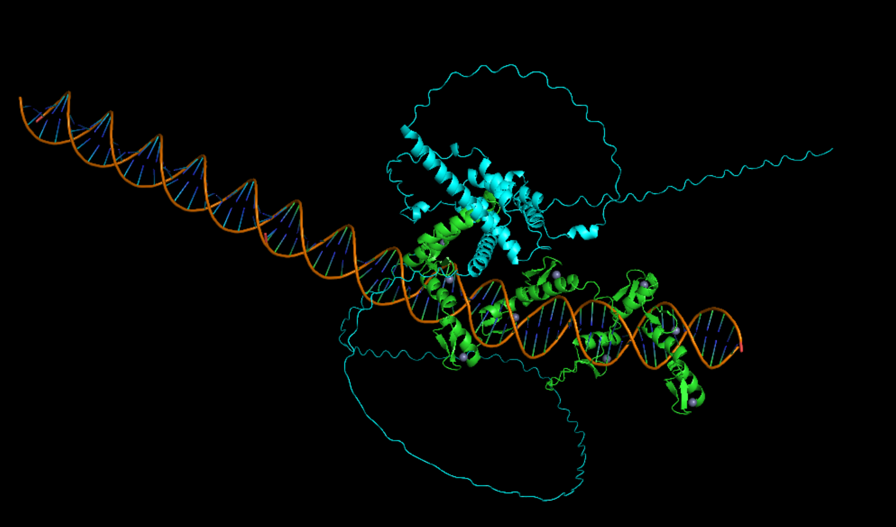
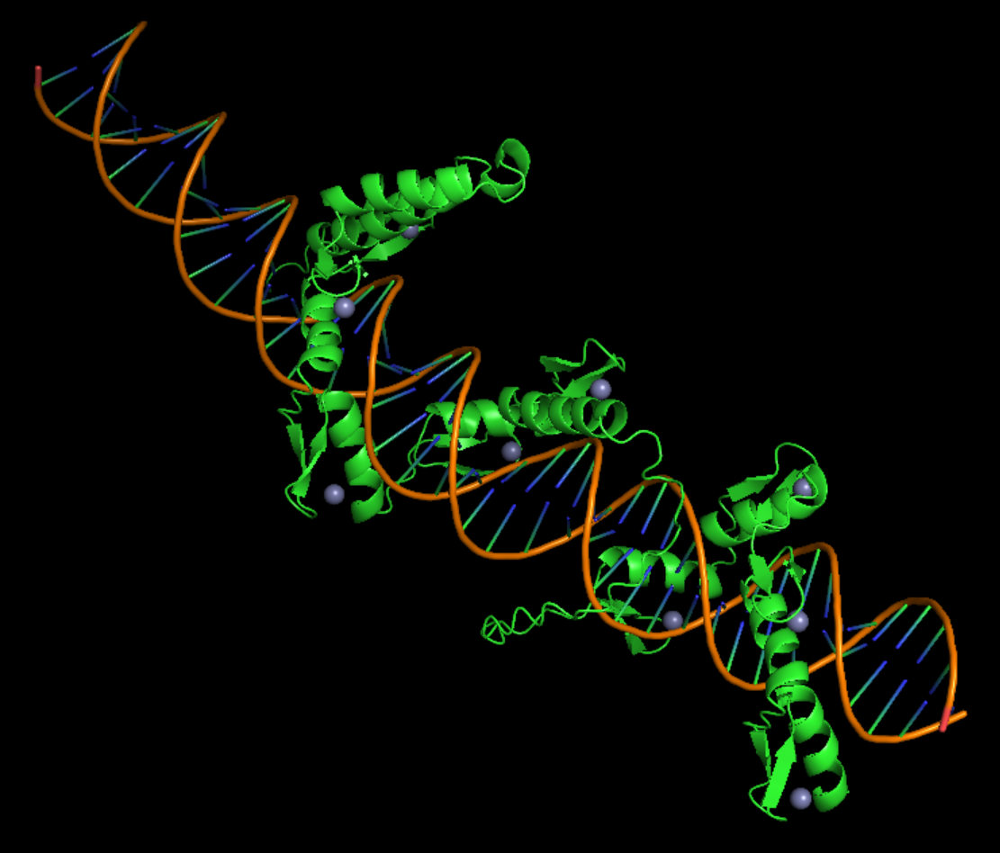
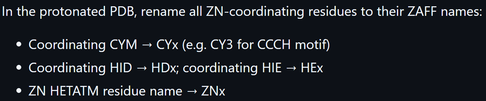

# 🔬 PDB/MMCIF toolkit in Molecular Dynamic Simulation workflows

> [!WARNING]
> Formerly published on PyPI as `pdb-select`. That name is deprecated — use `pdb-md`.

> Pre- and post-processing toolkit for PDB/MMCIF structure files in molecular dynamics workflows.  

# Prerequisites

> Always check for the forums of the MD simulation software you are using.

|Tool| Description | Url |
|--|--|--|
|Amber| Amber Mailing List Archive |http://archive.ambermd.org/ <br><br> https://cse.google.com/cse?cx=partner-pub-9700140137778662:8927431201&ie=UTF-8&sa=Search&ref=lists.ambermd.org/ |
|Gromacs|GROMACS community forums | https://gromacs.bioexcel.eu/ |
|| 计算化学公社- 高水平计算化学、理论化学交流论坛[`CHINESE`]  | http://bbs.keinsci.com/forum.php |

# Installation

```bash
pip install pdb-md
```

# Usage

```bash
❯ pdb-md --help
                                                                                                                                                    
 Usage: pdb-md [OPTIONS] COMMAND [ARGS]...                                                                                                          
                                                                                                                                                    
 Pre- and post-processing toolkit for PDB/MMCIF structure files in molecular dynamics workflows.                                                    
                                                                                                                                                    
╭─ Options ────────────────────────────────────────────────────────────────────────────────────────────────────────────────────────────────────────╮
│ --install-completion          Install completion for the current shell.                                                                          │
│ --show-completion             Show completion for the current shell, to copy it or customize the installation.                                   │
│ --help                        Show this message and exit.                                                                                        │
╰──────────────────────────────────────────────────────────────────────────────────────────────────────────────────────────────────────────────────╯
╭─ Commands ───────────────────────────────────────────────────────────────────────────────────────────────────────────────────────────────────────╮
│ select        Select segments from a PDB or MMCIF structure file.                                                                                │
│ termini-rm5p  Remove terminal phosphate groups from nucleic acids, e.g. 5' phosphate group from DNA/RNA.                                         │
│ res-rename    Rename residues of specified chains and residue numbers, e.g. to the residue names a                                               │
│               force field expects for a given protonation state (HIS -> HIE/HID/HIP, CYS -> CYM).                                                │
╰──────────────────────────────────────────────────────────────────────────────────────────────────────────────────────────────────────────────────╯

                                                               
```

## 1️⃣ select

> [!WARNING] 
> The `segment` range parameter we using is filtered based on `resseq of (hetflag, resseq, icode) tuple output by residue.get_id() in Bio.PDB module of biopython`.
> 
> Resseq from few structures match UniProt. We only perform this test on AlphaFold output files.
> 
> So, we strongly recommend you to check th `SIFTS` mapping file for the structure you are going to use, and make sure the `segment` parameter is correct in Uniprot sequence-level meaning (most case).

`Select segments from a PDB or MMCIF structure file`

```bash
❯ pdb-md select --help
                                                                                                                                                                               
 Usage: pdb-md select [OPTIONS]                                                                                                                                                
                                                                                                                                                                               
 Select segments from a PDB or MMCIF structure file.                                                                                                                           
                                                                                                                                                                               
╭─ Options ───────────────────────────────────────────────────────────────────────────────────────────────────────────────────────────────────────────────────────────────────╮
│ *  --input        -I      <path>  Input PDB or MMCIF file [required]                                                                                                        │
│    --output       -O      <path>  Output PDB file, defaults to <input stem>_selected.pdb in the current working directory                                                   │
│ *  --segment      -S      <str>   Segments to select, either 'chain' (whole chain, e.g. A) or 'chain:start-end' (e.g. A:1-10). Repeatable. The start-end range filters      │
│                                   polymer residues only; HETATM residues on the same chain are gated solely by --keep-hetero.                                               │
│                                   [required]                                                                                                                                │
│    --keep-hetero  -H      <str>   Keep HETATM residues. Repeatable. Each entry is 'spec' where spec is 'none','all', or a comma-separated list of residue names (e.g. 'ZN'  │
│                                   or 'ZN,HOH'). An entry without a colon/chain is the global default for every chain; an entry with a chain (e.g. 'A:all') overrides the    │
│                                   global set for that chain. Entries in the same scope are combined by union (-H ZN -H HOH == -H ZN,HOH); a chain entry replaces, not       │
│                                   merges with, the global set. A chain must also appear in --segment, otherwise it is dropped before -H is consulted.                       │
│    --help                         Show this message and exit.                                                                                                               │
╰─────────────────────────────────────────────────────────────────────────────────────────────────────────────────────────────────────────────────────────────────────────────╯
```

example:

```bash
pdb-md select -I znf263_all_hs7_30_0.54_0.37_model_0.cif -O znf263_all_hs7_30_0.54_0.37_model_0_selected.pdb -S A:369-683 -S B -S C -S D -S E -S F -S G -S H -S I -S J -S K:1-47 -S L:29-75 -H ZN
```

change from 
 to


---

### Selecting HETATM / heterogen residues 

> In short: polymer residue is governed by `range` + `chain` double filter, while HETATM is governed by `chain` only. The `--keep-hetero` option is the only way to keep HETATM residues.

HETATM residues (ions, ligands, waters, sugars) are selected at the **chain** level, not by residue range. The `chain:start-end` syntax filters polymer residues only.

Consequences:

- A chain made entirely of HETATM (e.g. a single Zn ion, a glycan chain) is governed by the chain whitelist alone — `-S B` keeps the whole Zn.
- On a **mixed** chain, `chain:start-end` does NOT narrow which HETATM are kept: `-S A:1-3 --keep-hetero UNX` still keeps `UNX` at resid 109, because the HETATM branch ignores `regions`.
- `--keep-hetero ''` (default) drops every HETATM; `all` keeps them all; a comma list (e.g. `ZN, HOH`) is an exact resname whitelist (case-insensitive).

To pick specific HETATM on a mixed chain, split the chain in preprocessing (e.g. give the heterogen its own chain id) — the current CLI has no per-HETATM range selector.

#### `--keep-hetero` syntax 

`-H` is repeatable. Each entry is `[chain:]spec`:  

| entry | meaning |
|---|---|
| `-H ZN` | global: every chain keeps HETATM named `ZN` | 
| `-H ZN,HOH` | global: every chain keeps `ZN` and `HOH` |  
| `-H all` | global: every chain keeps all HETATM |
| `-H none` / `-H ''` | global: every chain drops all HETATM (default) | 
| `-H A:all` | chain A keeps all of its HETATM | 
| `-H A:none` | chain A drops all of its HETATM |
| `-H E:ZN,HOH` | chain E keeps only `ZN` and `HOH` |

Two rules govern how entries combine:  
1. **Union within the same scope.** Several entries for the same scope add up:
`-H ZN -H HOH` ≡ `-H ZN,HOH`, and `-H E:ZN -H E:HOH` ≡ `-H E:ZN,HOH`.
Adding an entry never removes something already whitelisted.
2. **A chain entry overrides the global entry.** A chain that has its own
`[chain:]` entry uses *only* that set and ignores the global one. This is what
makes per-chain removal expressible: `-H ZN -H J:none` keeps `ZN` everywhere except chain J.

A `-H` chain id must also appear in `--segment`; otherwise the chain is dropped before `-H` is ever consulted, and a warning is printed.

## 2️⃣ preprocessing for MD simulation

Here we summarize several important easy to use application for fixing problems in Protein Data Bank files in preparation for simulating them.

|Tool name|Description|Url| Note |
|--|--|--| --- |
|PDBFixer|PDBFixer is an easy to use application for fixing problems in Protein Data Bank files in preparation for simulating them|https://github.com/openmm/pdbfixer <br><br> https://htmlpreview.github.io/?https://github.com/openmm/pdbfixer/blob/master/Manual.html| General purpose tool for fixing PDB files|
|pdb2gmx|gmx pdb2gmx reads a .pdb (or .gro) file, reads some database files, adds hydrogens to the molecules and generates coordinates in GROMACS (GROMOS), or optionally .pdb, format and a topology in GROMACS format. These files can subsequently be processed to generate a run input file|https://manual.gromacs.org/current/onlinehelp/gmx-pdb2gmx.html| Designed for preparing PDB files for GROMACS simulations, pdb2gmx is a subcommand of GROMACS tool gmx —— `gmx pdb2gmx`, it has several options for pdb file processing like `-ignh` to add the hydrogens, see in `gmx pdb2gmx -h` |
|pdb4amber|Analyse PDB files and clean them for further usage, especially with the LEaP programs of Amber |https://ambermd.org/AmberTools.php | pdb4amber tool from the AmberTools MD package, designed for preparing PDB files for Amber simulations, also a command-line utility in the AmberTools suite —— `pdb4amber`, it also has several options for pdb file processing, Removing hydrogen or water atoms, see `pdb4amber -h`  |
|BioForge|BioForge is a pure-Rust toolkit for automated preparation of biological macromolecules. It reads experimental structures (PDB/mmCIF), reconciles them with high-quality residue templates, repairs missing atoms, assigns hydrogens and termini, builds topologies, and optionally solvates the system with water and ions—all without leaving the Rust type system|https://github.com/TKanX/bio-forge||
|pdbtools|A set of tools for manipulating and doing calculations on wwPDB macromolecule structure files|https://github.com/harmslab/pdbtools| see `File/structure manipulation` part for cleaning function in https://github.com/harmslab/pdbtools#filestructure-manipulation |
|pdb-tools|A dependency-free cross-platform swiss army knife for PDB files|https://github.com/haddocking/pdb-tools|see https://www.bonvinlab.org/pdb-tools/|


### `normal preprocessing`

> cited from pdbfixer manual
```bash
- If the structure was generated by X-ray crystallography, most or all of the hydrogen atoms will usually be missing.
- There may also be missing heavy atoms in flexible regions that could not be clearly resolved from the electron density. This may include anything from a few atoms at the end of a sidechain to entire loops.
- Many PDB files are also missing terminal atoms that should be present at the ends of chains.
- The file may include nonstandard residues that were added for crystallography purposes, but are not present in the naturally occurring molecule you want to simulate.
- The file may include more than what you want to simulate. For example, there may be salts, ligands, or other molecules that were added for experimental purposes. Or the crystallographic unit cell may contain multiple copies of a protein, but you only want to simulate a single copy.
- There may be multiple locations listed for some atoms.
- If you want to simulate the structure in explicit solvent, you will need to add a water box surrounding it.
- For membrane proteins, you may also need to add a lipid membrane.
```

you can
```bash
Add missing heavy atoms.
Add missing hydrogen atoms.
Build missing loops.
Convert non-standard residues to their standard equivalents.
Select a single position for atoms with multiple alternate positions listed.
Delete unwanted chains from the model.
Delete unwanted heterogens.
Build a water box for explicit solvent simulations.

Remove Chains
Identify Missing Residues
Replace Nonstandard Residues
Remove Heterogens
Add Missing Heavy Atoms
Add Missing Hydrogens
Add Water
Add Membrane
```

### `Removal of terminal phosphate group for Nucleic Acid`

> It is usually suggested that while preparing a nucleic acid system for simulation, 5' terminal phosphate group must be removed; or any terminal charged phosphate group should be removed...
>
> Nucleic acids typically do not have 5’-phosphate groups. Force fields are parametrized to the most common use cases and do not necessarily cover all possible chemical space. Delete the phosphate atoms from the 5’-nucleotide and you can generate the topology such that it has a free 5’-hydroxyl group.

> In most cases, e.g. for DNA simulations, 5’-phosphate groups are less cared about, so you can just delete them

Remove any phosphate group from terminal residues; these are often present synthetically but are not how force fields are typically parametrized (5’-OH terminus is typical).

In detail, we just need to remove the **`[O1P/OP1, O2P/OP2, O3P/OP3 if exists, P, Hydrogens attached to them]`** atoms from the 5' terminal residue of a nucleic acid chain.

You can use the `termini-rm5p` command to remove the 5' terminal phosphate group from nucleic acids as talked above.

```bash
❯ pdb-md termini-rm5p --help
                                                                                                                                                                                                          
 Usage: pdb-md termini-rm5p [OPTIONS]                                                                                                                                                                     
                                                                                                                                                                                                          
 Remove terminal phosphate groups from nucleic acids, e.g. 5' phosphate group from DNA/RNA.                                                                                                               
                                                                                                                                                                                                          
╭─ Options ──────────────────────────────────────────────────────────────────────────────────────────────────────────────────────────────────────────────────────────────────────────────────────────────╮
│ *  --input   -I      <path>  Input PDB or MMCIF file [required]                                                                                                                                        │
│    --output  -O      <path>  Output PDB file, defaults to <input stem>_rm5p.pdb in the current working directory                                                                                       │
│    --chain   -C      <str>   Chains to process. Repeatable. If not provided, all chains will be processed.                                                                                             │
│    --help                    Show this message and exit.                                                                                                                                               │
╰────────────────────────────────────────────────────────────────────────────────────────────────────────────────────────────────────────────────────────────────────────────────────────────────────────╯
```

```bash
❯ pdb-md termini-rm5p -I znf263_all_hs7_30_0.54_0.37_model_0_selected.pdb -C K -C L

Wrote znf263_all_hs7_30_0.54_0.37_model_0_selected_rm5p.pdb
  chain K: removed OP3, P, OP1, OP2
  chain L: removed P, OP1, OP2
```


### `protonation(add hydrogens) and residue renaming`

protonation state of the protein is important for MD simulation. The protonation state of a protein can be determined by the pH of the environment, which can affect the charge and conformation of the protein.

Here we summarize several tools for predicting or assigning the protonation state of a protein:

> Basically predicted/assigned based on comparison between Pka calculation and the pH of the environment. 

|Tool name|Description|Url| Note |
|--|--|--| --- |
|H++ |H++ is an automated system that computes pK values of ionizable groups in macromolecules and adds missing hydrogen atoms according to the specified pH of the environment. Given a (PDB) structure file on input, H++ outputs the completed structure in several common formats (PDB, PQR, AMBER inpcrd/prmtop) and provides a set of tools for analysis of electrostatic-related molecular properties.|http://newbiophysics.cs.vt.edu/H++/index.php||
| PDB2PQR|APBS-PDB2PQR software suite, Use PROPKA to assign protonation states at provided pH |https://server.poissonboltzmann.org/pdb2pqr||
|PROPKA|PROPKA predicts the pKa values of ionizable groups in proteins and protein-ligand complexes based in the 3D structure.|https://github.com/jensengroup/propka| |
|PKA17|PKA17: the grid-based pKa calculator for proteins|http://kaminski.wpi.edu/PKA17/pka_calc.html||
|pdb2gmx| `gmx pdb2gmx`, see above| https://manual.gromacs.org/current/onlinehelp/gmx-pdb2gmx.html| pdb2gmx --ignh |
|pdbfixer| see above |https://github.com/openmm/pdbfixer <br><br> https://htmlpreview.github.io/?https://github.com/openmm/pdbfixer/blob/master/Manual.html| |
|tleap/pdb4amber|see ambertools above|  | |

> Of course, in most cases, people still rely on `prior knowledge` to determine the protonation state of specific residues. For example, tetracoordinate zinc finger proteins have been thoroughly studied, and the protonation states of coordinating atoms within this motif are well known, so computational tools are generally not required for such determinations.
>
> In many cases, `successful assignment of protonation states is often coupled with residue renaming operations`. This is because in most force fields, the protonation state of a residue is distinguished by its residue name. For instance, the three protonation states of HIS correspond to three residue names: HID, HIE, and HIP. Therefore, residue renaming is usually needed after the protonation state is determined.
>
> Take the classic tetracoordinate zinc finger protein as an example. The coordinating CYS and HIS residues are commonly renamed to CYM, HID/HIE/HIP, or further processed (e.g., ZAFF), so that the force field can correctly recognize their protonation states.
>
> Here we take ZAFF as an example, with reference to [ZAFF](https://ambermd.org/tutorials/advanced/tutorial20/ZAFF.php).




> For residue renaming, most scripts are based on raw text processing given that the PDB file is an 80-column, fixed-width text file. However, this approach is not robust and can easily introduce errors **just as manual editing does**. Therefore, we recommend using the 'biopython' library to read the PDB file, modify the residue names, and then write it back to a new PDB file. This method is more robust and less error-prone.

You can use the `res-rename` command to rename residues by chain and residue number. This applies a renaming you have already decided on; the protonation-state *decision* itself is made beforehand (by the tools above, or by hand).

```bash
❯ pdb-md res-rename --help
                                                                                                                                                                                          
 Usage: pdb-md res-rename [OPTIONS]                                                                                                                                                       
                                                                                                                                                                                          
 Rename residues of specified chains and residue numbers, e.g. to the residue names a force field expects for a given protonation state (HIS -> HIE/HID/HIP, CYS -> CYM).                 
                                                                                                                                                                                          
╭─ Options ──────────────────────────────────────────────────────────────────────────────────────────────────────────────────────────────────────────────────────────────────────────────╮
│ *  --input   -I      <path>  Input PDB or MMCIF file [required]                                                                                                                        │
│    --output  -O      <path>  Output PDB file, defaults to <input stem>_renamed.pdb in the current working directory                                                                    │
│ *  --rename  -R      <str>   Residue to rename as 'chain:resnum:newresname' (e.g. A:20:HIE). Repeatable. resnum is the residue number carried by that chain's own records (columns     │
│                              23-26); it is not the atom serial, and it does not necessarily restart at 1 per chain. The new name may be at most 4 characters.                          │
│                              [required]                                                                                                                                                │
│    --help                    Show this message and exit.                                                                                                                               │
╰────────────────────────────────────────────────────────────────────────────────────────────────────────────────────────────────────────────────────────────────────────────────────────╯
```

example:

```bash
pdb-md res-rename \
-I znf263_all_hs7_30_0.54_0.37_model_0_selected_rm5p_renum.pdb \
-R A:12:CY4 \
-R A:15:CY4 \
-R A:68:CY4 \
-R A:71:CY4 \
-R A:96:CY4 \
-R A:99:CY4 \
-R A:124:CY4 \
-R A:127:CY4 \
-R A:152:CY4 \
-R A:155:CY4 \
-R A:209:CY4 \
-R A:212:CY4 \
-R A:237:CY4 \
-R A:240:CY4 \
-R A:265:CY4 \
-R A:268:CY4 \
-R A:293:CY4 \
-R A:296:CY4 \
-R A:28:HD2 \
-R A:32:HD2 \
-R A:84:HD2 \
-R A:88:HD2 \
-R A:112:HD2 \
-R A:116:HD2 \
-R A:140:HD2 \
-R A:144:HD2 \
-R A:168:HD2 \
-R A:172:HD2 \
-R A:225:HD2 \
-R A:229:HD2 \
-R A:253:HD2 \
-R A:257:HD2 \
-R A:281:HD2 \
-R A:285:HD2 \
-R A:309:HD2 \
-R A:313:HD2 \
-R B:316:ZN4 \
-R C:317:ZN4 \
-R D:318:ZN4 \
-R E:319:ZN4 \
-R F:320:ZN4 \
-R G:321:ZN4 \
-R H:322:ZN4 \
-R I:323:ZN4 \
-R J:324:ZN4

```

the log shows:

```bash
Wrote znf263_all_hs7_30_0.54_0.37_model_0_selected_rm5p_renum_renamed.pdb
  chain A: 12 CYS -> CY4
  chain A: 15 CYS -> CY4
  chain A: 68 CYS -> CY4
  chain A: 71 CYS -> CY4
  chain A: 96 CYS -> CY4
  chain A: 99 CYS -> CY4
  chain A: 124 CYS -> CY4
  chain A: 127 CYS -> CY4
  chain A: 152 CYS -> CY4
  chain A: 155 CYS -> CY4
  chain A: 209 CYS -> CY4
  chain A: 212 CYS -> CY4
  chain A: 237 CYS -> CY4
  chain A: 240 CYS -> CY4
  chain A: 265 CYS -> CY4
  chain A: 268 CYS -> CY4
  chain A: 293 CYS -> CY4
  chain A: 296 CYS -> CY4
  chain A: 28 HIS -> HD2
  chain A: 32 HIS -> HD2
  chain A: 84 HIS -> HD2
  chain A: 88 HIS -> HD2
  chain A: 112 HIS -> HD2
  chain A: 116 HIS -> HD2
  chain A: 140 HIS -> HD2
  chain A: 144 HIS -> HD2
  chain A: 168 HIS -> HD2
  chain A: 172 HIS -> HD2
  chain A: 225 HIS -> HD2
  chain A: 229 HIS -> HD2
  chain A: 253 HIS -> HD2
  chain A: 257 HIS -> HD2
  chain A: 281 HIS -> HD2
  chain A: 285 HIS -> HD2
  chain A: 309 HIS -> HD2
  chain A: 313 HIS -> HD2
  chain B: 316 ZN -> ZN4
  chain C: 317 ZN -> ZN4
  chain D: 318 ZN -> ZN4
  chain E: 319 ZN -> ZN4
  chain F: 320 ZN -> ZN4
  chain G: 321 ZN -> ZN4
  chain H: 322 ZN -> ZN4
  chain I: 323 ZN -> ZN4
  chain J: 324 ZN -> ZN4
```

**CRITICAL**: TER record must separate protein chain from each ZN residue — tLEaP uses TER to avoid creating unwanted bonds to adjacent residues.

```
grep "^TER" znf263_all_hs7_30_0.54_0.37_model_0_selected_rm5p_renum_renamed.pdb       # TER after each chain and after protein before ZN
grep "ZN[0-9]\|CY[0-9]\|HD[0-9]\|HE[0-9]" znf263_all_hs7_30_0.54_0.37_model_0_selected_rm5p_renum_renamed.pdb | head
```

> **A note on 4-character residue names.** A PDB residue name occupies columns 18-20, but some force fields use 4-character names (GROMOS `HISA`/`HISB`, CHARMM `CYSH`) that borrow the blank column 21 between the name and the chain id. Biopython's `PDBIO` formats the residue name with a *minimum* width of 3, which does not truncate: a 4-character name pushes every following column one to the right and emits an 81-column record with the chain id and residue number out of place -- a record fixed-column parsers read wrong. `res-rename` renders the file in memory and repairs those records before saving, so both 3- and 4-character names come out as well-formed 80-column lines. Names longer than 4 characters are rejected outright, since they have nowhere in the format to go. 
> 
> This note covers writing only. Biopython's parser reads the residue name from three columns, so a 4-character name already in the input is silently truncated to three (no error) -- and that includes the file this command writes. Re-running any `pdb-md` command on `res-rename`'s output will lose the 4th character, so the truncation is reported as a warning.


## 3️⃣ Force Fields & Water Models

> How to Prepare Force Fields and Choose Water Models in MD Simulation Setup?
>
> Please check our materials first in [Molecular Dynamics Force Fields: How to Choose, How to Configure, and What to Do When Parameters Are Missing?](./refers/ff&water.md)
>
> And then check the official documentation of the MD simulation software you are using for detailed instructions on how to prepare force fields and choose water models.


| System | Starting parameter sets to consider | Items to be verified |
|--------|--------------------------------------|-----------------------|
| Canonical proteins | AMBER ff14SB/ff19SB, CHARMM36m, OPLS-AA/M | Protein type, conformational state, solvent setup, and relevant experimental validations |
| Protein–small organic molecule | Protein force field paired with GAFF2, CGenFF, OpenFF Sage, or corresponding OPLS small-molecule parameters | Ligand chemical environment, charge scheme, critical dihedral angles, and cross-component interactions |
| DNA, RNA and protein–nucleic acid complexes | Dedicated nucleic acid force fields, e.g., AMBER DNA/RNA parameter sets | DNA and RNA are not interchangeable; sequence, structure, modifications and ionic conditions need to be checked |
| Lipid bilayers, membrane proteins | Specialized lipid parameters such as AMBER Lipid21 | Lipid species, membrane composition, and compatibility with proteins, water and ions |
| Sugars, polysaccharides, glycoproteins | Carbohydrate force fields such as GLYCAM | Monosaccharide stereochemistry, anomeric configuration, linkage positions, glycosidic bonds and protein–glycan linkages |
| Intrinsically disordered proteins, flexible peptides | Parameter sets validated for disordered states, e.g., studies using CHARMM36m | Stability alone is insufficient; conformational distribution, global dimensions and secondary structure propensity must be assessed |
| Metalloproteins, metalloenzymes | Specialized nonbonded or bonded models, or QM/MM approaches depending on the research question | Oxidation state, coordination geometry, ligand exchange, and possible chemical reactions |
| Non-natural residues, post-translational modifications, covalent ligands | Pre-validated custom residue parameters or supplementary parameterization | Not only newly added groups but also new covalent connections to the parent structure |

> Selection criteria for proteins, small molecules and specialized components can be found in the original publications of ff19SB, CHARMM36m and OPLS-AA/M, as well as AMBER official documentation for component parameters.

For typical protein-nucleic acid complexes, the following force field combinations are often used:
```bash
CHARMM36m/CHARMM36 + CHARMM36 NA + CHARMM-TIP3P
Amber-ff19SB + OL24/OL21 + OPC
Amber-ff14SB + OL15/bsc1 + TIP3P 
```

> e.g. Considering the compatibility of ZAFF (built with tip3p water model) with the protein-nucleic acid force field, we recommend using the following force field combinations for Zinc finger protein-DNA complex: `Amber-ff14SB + bsc1 + TIP3P`

## 4️⃣ Topology and System Construction

> `Structure Preprocessing & Standardization`: done in 1️⃣2️⃣3️⃣
>
> `Force Field Allocation & Initial Topology Generation`:
>
> 1. Assign force field parameters: Map the atom types, charges (e.g., RESP or AM1-BCC for ligands), and bonding rules based on the selected force field (e.g., AMBER, CHARMM, OPLS).
> 2. Generate structural topology: Create the core topology file containing molecular connectivity, mass, and non-bonded parameters.
>
> `System Solvation & Periodic Boundary Definition`: 
> 1. Define the simulation box: Setup Periodic Boundary Conditions (PBC) by choosing a box geometric shape (e.g., cubic, truncated octahedron) and setting a minimum clearance distance from the solute to the box edge (typically 10–12 Å).
> 2. Add solvent molecules: Fill the defined box with an explicit water model (e.g., TIP3P, SPC/E, OPC).
>
> `System Neutralization & Ionization`:
> 1. Neutralize net charge: Calculate the total net charge of the system and add a corresponding number of counter-ions (Na⁺ or Cl⁻) to achieve a net charge of zero.
> 2. Set ionic concentration: Add extra ion pairs to mimic physiological salinity conditions (commonly 0.15 M NaCl).
>
> `Final Coordination & Parameter Export`:
> - Compile simulation-ready inputs: Merge all components into final structural coordinate files and master topology files compatible with your targeted simulation engine (e.g., .prmtop/.inpcrd for AMBER, or .gro/.top for GROMACS).

For typical Gromacs topology construction workflow, you can refer to [mdtutorials](http://www.mdtutorials.com/gmx/index.html), generally like:

```bash
# after `Structure Preprocessing & Standardization` according to your system

# initialize your topology
# The topology (topol.top by default) contains all the information necessary to define the molecule within a simulation. This information includes nonbonded parameters (atom types and charges) as well as bonded parameters (bonds, angles, and dihedrals)
gmx pdb2gmx 

# Defining the Unit Cell & Adding Solvent
# Define the box dimensions using the editconf module
gmx editconf
# Fill the box with water using the solvate module
gmx solvate

# Adding Ions
# The tool for adding ions within GROMACS is called genion. What genion does is read through the topology and replace water molecules with the ions that the user specifies. The input is called a run input file, which has an extension of .tpr; this file is produced by the GROMACS grompp module (GROMACS pre-processor), which will also be used later when we run our first simulation. What grompp does is process the coordinate file and topology (which describes the molecules) to generate an atomic-level input (.tpr). The .tpr file contains all the parameters for all of the atoms in the system.
# To produce a .tpr file with grompp, we will need an additional input file, with the extension .mdp (molecular dynamics parameter file); grompp will assemble the parameters specified in the .mdp file with the coordinates and topology information to generate a .tpr file.
# An .mdp file is normally used to run energy minimization or an MD simulation, but in this case is simply used to generate an atomic description of the system

# prepare your .mdp file ——> produce a .tpr file with grompp + .mdp ——> add ions with genion + .tpr
gmx grompp
gmx genion
```


Normally, we can directly use the complete GROMACS workflow. However, there are some exceptional cases. For example, when modeling zinc finger proteins involving ZAFF, we need to employ Amber ZAFF to construct the topological system.

> For details, please refer to [ZAFF tutorial](https://ambermd.org/tutorials/advanced/tutorial20/ZAFF.php) and  [ZAFF issue in Amber forum](https://cse.google.com/cse?cx=partner-pub-9700140137778662:8927431201&ie=UTF-8&q=ZAFF+&sa=Search&ref=)


```bash
source leaprc.protein.ff14SB # for protein
source leaprc.DNA.bsc1 # for dna
source leaprc.water.tip3p # for water
addAtomTypes { { "ZN" "Zn" "sp3" } { "S4" "S" "sp3" } { "N3" "N" "sp3" } } # C2H2 center ID4
loadamberparams frcmod.ions1lm_126_tip3p # for ions
loadamberprep ZAFF.prep
loadamberparams ZAFF.frcmod
mol = loadpdb znf263_all_hs7_30_0.54_0.37_model_0_selected_rm5p_renum_renamed.pdb

# for 9 zn2+ ions, SG for CY4, NE2 for HD2
# CY4 list (CYS): 12,15,68,71,96,99,124,127,152,155,209,212,237,240,265,268,293,296
# HD2 list (HIS): 28,32,84,88,112,116,140,144,168,172,225,229,253,257,281,285,309,313

# for zn1 (mol.316.ZN)
bond mol.316.ZN mol.12.SG
bond mol.316.ZN mol.15.SG
bond mol.316.ZN mol.28.NE2
bond mol.316.ZN mol.32.NE2

# for zn2 (mol.317.ZN)
bond mol.317.ZN mol.68.SG
bond mol.317.ZN mol.71.SG
bond mol.317.ZN mol.84.NE2
bond mol.317.ZN mol.88.NE2

# for zn3 (mol.318.ZN)
bond mol.318.ZN mol.96.SG
bond mol.318.ZN mol.99.SG
bond mol.318.ZN mol.112.NE2
bond mol.318.ZN mol.116.NE2

# for zn4 (mol.319.ZN)
bond mol.319.ZN mol.124.SG
bond mol.319.ZN mol.127.SG
bond mol.319.ZN mol.140.NE2
bond mol.319.ZN mol.144.NE2

# for zn5 (mol.320.ZN)
bond mol.320.ZN mol.152.SG
bond mol.320.ZN mol.155.SG
bond mol.320.ZN mol.168.NE2
bond mol.320.ZN mol.172.NE2

# for zn6 (mol.321.ZN)
bond mol.321.ZN mol.209.SG
bond mol.321.ZN mol.212.SG
bond mol.321.ZN mol.225.NE2
bond mol.321.ZN mol.229.NE2

# for zn7 (mol.322.ZN)
bond mol.322.ZN mol.237.SG
bond mol.322.ZN mol.240.SG
bond mol.322.ZN mol.253.NE2
bond mol.322.ZN mol.257.NE2

# for zn8 (mol.323.ZN)
bond mol.323.ZN mol.265.SG
bond mol.323.ZN mol.268.SG
bond mol.323.ZN mol.281.NE2
bond mol.323.ZN mol.285.NE2

# for zn9 (mol.324.ZN)
bond mol.324.ZN mol.293.SG
bond mol.324.ZN mol.296.SG
bond mol.324.ZN mol.309.NE2
bond mol.324.ZN mol.313.NE2

# check the mol
check mol

# save the pdb file
savepdb mol znf263_all_hs7_30_0.54_0.37_model_0_selected_rm5p_renum_renamed_dry.pdb
# optional:Save the topology and coordiante files
# saveamberparm mol znf263_all_hs7_30_0.54_0.37_model_0_selected_rm5p_renum_renamed_dry.prmtop znf263_all_hs7_30_0.54_0.37_model_0_selected_rm5p_renum_renamed_dry.inpcrd

# solvate the system using TIP3P water box, 10 A is general, need ≥ non-bond cutoff/2
solvateBox mol TIP3PBOX 10.0

# 

```

## 5️⃣ Start Simulation

A typical simulation

Similarly, we can adopt the amber system and perform simulations with the amber dynamics engine,
or adopt the gromacs system and carry out simulations using the gromacs dynamics engine.

Following point 4️⃣ above, we uniformly use the gromacs simulation engine here to simulate the topological system constructed by amber ZAFF.


## final

### A typical workflow for preparing a PDB file for MD simulation

pdbfixer(fix missing atoms, remove heterogens and hydrogens) -> pdb-md select (select chains and residues) -> pdb-md termini-rm5p (remove 5' terminal phosphate group for nucleic acids) -> pdb4amber renum(`optional`, but recommended) -> protonation (add hydrogens) status determined, followed by pdb-md res-rename (rename residues to the force field's protonation-state names) -> pdb4amber renum(`optional`, only if needed)  -> pdb2gmx/pdb4amber (generate topology and coordinates for MD simulation)